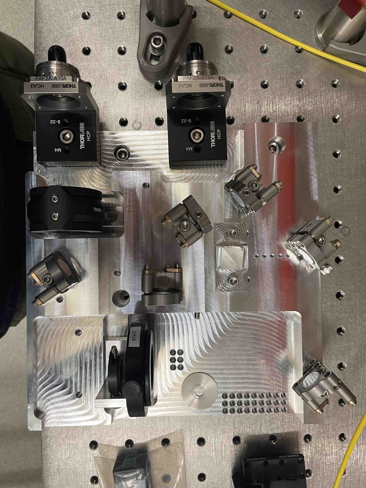

# README

This version of the double pass breadboard was first ordered in March, 2023.  This is very similar to the 2023-01-version - it is slightly smaller and includes more moutning holes.

# Parts list

[STEP files](https://drive.google.com/drive/folders/1z8gYKQsrM2GSww2NHeTRoyboD5y0jY1v?usp=share_link)

### Newport
* 6x [ST05-F2H ZeroDrift Optical Mount](https://www.newport.com/p/ST05-F2H) (interchangeable with [Thorlabs Polaris half inch low drift mirror mounts](https://www.thorlabs.com/thorproduct.cfm?partnumber=POLARIS-K05C4))

### Thorlabs
* 1x [LMR1 Lens Mount](https://www.thorlabs.com/thorproduct.cfm?partnumber=LMR1#ad-image-0)  
* 1x [ID8 Mounted Standard Iris](https://www.thorlabs.com/thorproduct.cfm?partnumber=ID8)
* 2x [HCA3 FiberBench Wall Plate](https://www.thorlabs.com/thorproduct.cfm?partnumber=HCA3)
* 2x [HCP Post Mounting Bracket for FiberPorts](https://www.thorlabs.com/thorproduct.cfm?partnumber=HCP)
* 1x [KM100PM/M AOM Mount](https://www.thorlabs.com/thorproduct.cfm?partnumber=KM100PM/M)
* 1x [LA1131-A-ML Plano-Convex Lens](https://www.thorlabs.com/thorproduct.cfm?partnumber=LA1131-A-ML)
* 1x [DLM1 Dual Rotation Mount](https://www.thorlabs.com/thorproduct.cfm?partnumber=DLM1#ad-image-0)
* 2x [PAF2A-A10B Achromatic FiberPort](https://www.thorlabs.com/thorproduct.cfm?partnumber=PAF2A-A10B)
* 1x [PBS202 Polarizing Beam Splitter](https://www.thorlabs.com/thorproduct.cfm?partnumber=PBS202)
* 1x [BB05-E02-10 Broadband Dielectric Mirror](https://www.thorlabs.com/thorproduct.cfm?partnumber=BB05-E02-10)

